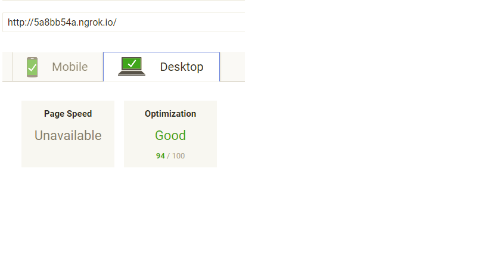
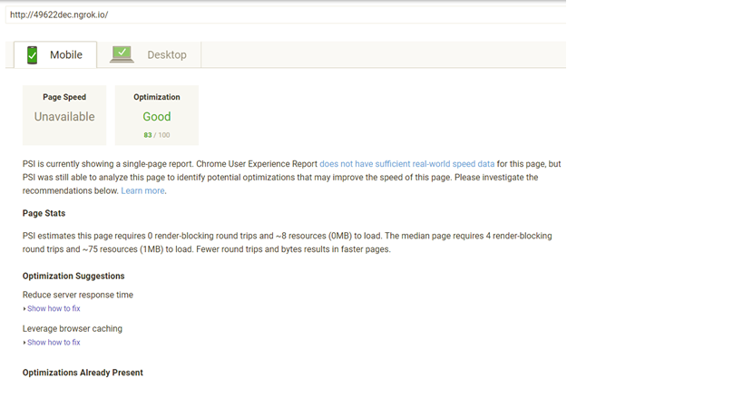

# Website Performance Optimization portfolio project
Your challenge is to optimize this online portfolio for speed! In particular, optimize the critical rendering path and make this page render as quickly as possible by applying the techniques you've picked up in the Critical Rendering Path course.

## Getting Started
You can *[clone](https://github.com/CindyLouWho2/CindyLouWho2.github.io.git)* or *[download](https://github.com/CindyLouWho2/CindyLouWho2.github.io.git)* this project via [GitHub](https://github.com) to your local machine.

## Part 1: Optimize PageSpeed Insights score for index.html 

I obtained a score of 94 on the Desktop but only 83 on the Mobile when running this through ngrok. My scores were even lower when running through Github. I do not know how to improve the mobile score since the optimization suggestions call for 'reducing the server response time" and 'leveraging browser caching' which are beyond my control. 

## Modifications to index.html to achieve at least a 90 PageSpeed score.  
_____________________________________________________________________________________________________

1. CSS styles file was removed and inlined in HTML
2. Added a media query for print
3. Moved the JS to end of HTML document
4. Removed the Google Analytics
5. Optimized all images by using *[tinyjpg](https://tinyjpg.com)* and/or *[online-convert](https://online-convert.com)*
6. Replaced Google webfont

## Modifications to pizza.html and main.js to obtain a FPS of 60.
__________________________________________________________________________________________________

1. Optimized all images by using *[tinyjpg](https://tinyjpg.com)* and/or *[online-convert](https://online-convert.com)*
2. Replaced querySelectorAll with getElementsByClassName
3. Moved multiple variables out of the For loops so they would be ran everytime the loop was
4. Reduced number of moving pizza's from 200 to 30 based on screen size

## Optimization Tips and Tricks
* [Optimizing Performance](https://developers.google.com/web/fundamentals/performance/ "web performance")
* [Analyzing the Critical Rendering Path](https://developers.google.com/web/fundamentals/performance/critical-rendering-path/analyzing-crp.html "analyzing crp")
* [Optimizing the Critical Rendering Path](https://developers.google.com/web/fundamentals/performance/critical-rendering-path/optimizing-critical-rendering-path.html "optimize the crp!")
* [Avoiding Rendering Blocking CSS](https://developers.google.com/web/fundamentals/performance/critical-rendering-path/render-blocking-css.html "render blocking css")

